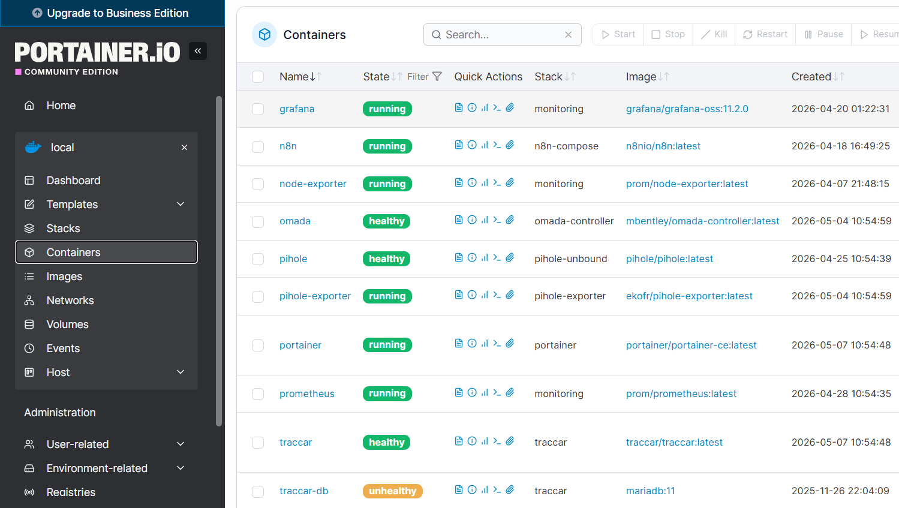
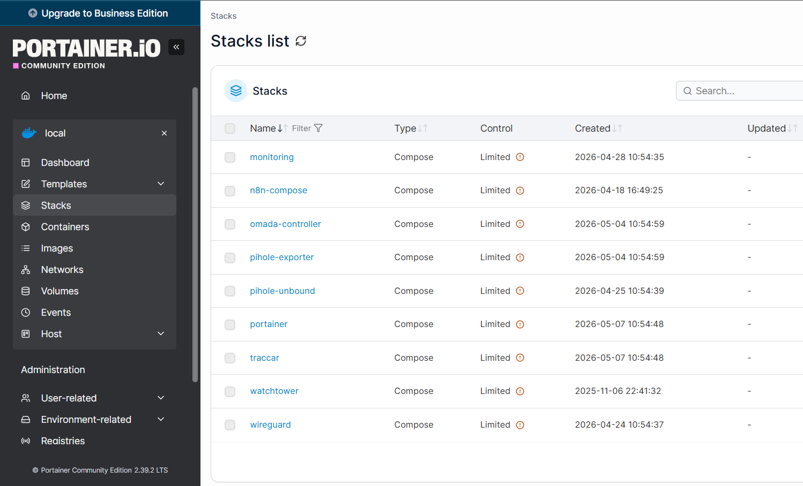
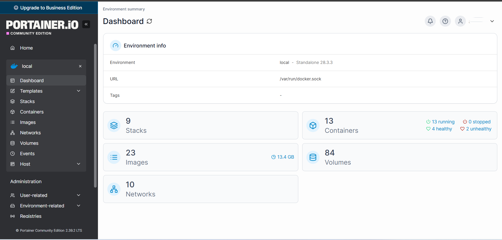
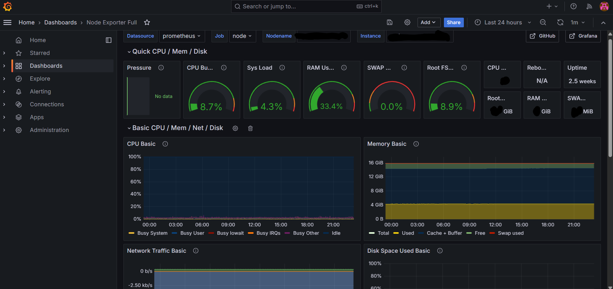
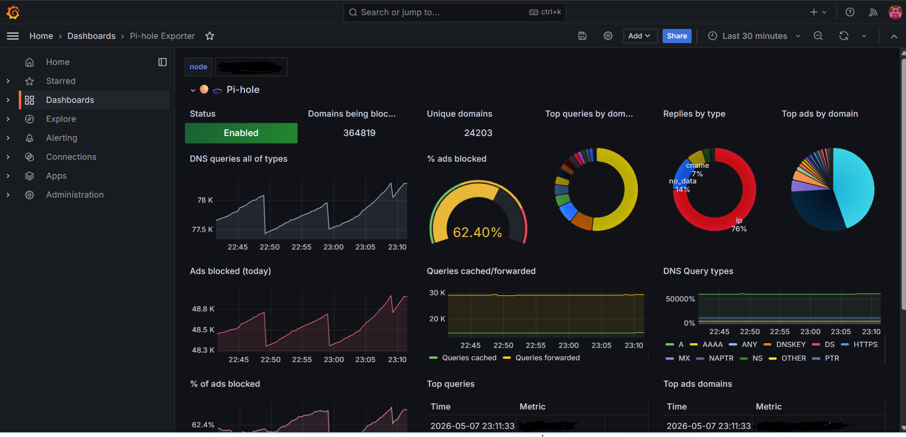
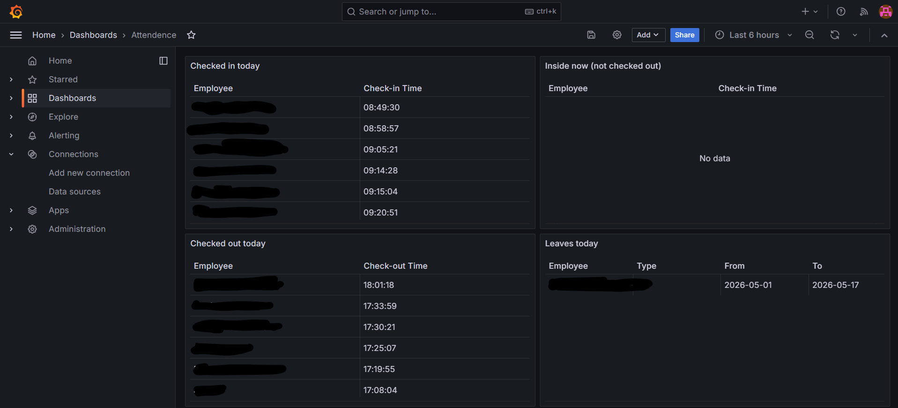

# Raspberry Pi Enterprise Stack

Enterprise-grade Raspberry Pi infrastructure stack focused on self-hosting, monitoring, observability, VPN access, secure networking, and infrastructure automation.

---


---

# Infrastructure Overview

This project demonstrates a production-style self-hosted infrastructure environment running on Raspberry Pi using Docker-based orchestration and monitoring tools.

Core focus areas include:

- Infrastructure monitoring
- Self-hosted services
- VPN & secure remote access
- DNS filtering
- Container orchestration
- Centralized logging
- Automation systems
- Dashboard observability
- Network management

---

# Technology Stack

| Category | Technologies |
|---|---|
| Infrastructure | Raspberry Pi 5, Linux |
| Containers | Docker, Docker Compose, Portainer |
| Monitoring | Grafana, Prometheus, Node Exporter |
| Logging | Loki |
| Networking | WireGuard, Tailscale, VLANs |
| DNS & Security | Pi-hole, Cloudflare Tunnel |
| Automation | n8n |
| Network Management | Omada Controller |
| Tracking | Traccar |
| Development | Python, Flask |

---

# Infrastructure Screenshots

## Portainer Container Management



---

## Portainer Stack Overview



---

## Portainer Infrastructure Dashboard



---

## Grafana Node Exporter Dashboard



---

## Pi-hole Monitoring Dashboard



---

## Attendance Monitoring Dashboard



---

# Repository Structure

```text
docs/          → Documentation & deployment guides
screenshots/   → Infrastructure screenshots
diagrams/      → Infrastructure diagrams
configs/       → Example configurations
monitoring/    → Monitoring-related files
```

---

# Included Services

| Service | Purpose |
|---|---|
| Portainer | Docker container management |
| Pi-hole | DNS filtering & ad blocking |
| Grafana | Monitoring dashboards |
| Prometheus | Metrics collection |
| Loki | Centralized logging |
| WireGuard | Secure VPN access |
| Cloudflare Tunnel | Secure external access |
| Omada Controller | Network infrastructure management |
| Nextcloud | Self-hosted cloud platform |
| Traccar | GPS tracking platform |
| n8n | Workflow automation |

---

# Features

- Dockerized infrastructure deployment
- Multi-service orchestration
- Infrastructure observability
- Dashboard-based monitoring
- Secure remote access
- Lightweight self-hosted architecture
- VLAN-ready networking design
- Automated service management
- Production-style infrastructure layout

---

# Documentation

- Deployment Guide
- Services Overview
- Infrastructure Diagram
- Security Notes
- Project Summary

Available inside the `docs/` directory.

---

# Security Notes

This repository contains sanitized infrastructure examples only.

Sensitive information such as:
- passwords
- domains
- API keys
- internal IPs
- tokens

have been intentionally removed or hidden.

---

# Goals

This project is focused on building scalable, secure, and observable self-hosted infrastructure using lightweight hardware and open-source technologies.

---

# Status

Active development and continuous infrastructure improvements in progress.
